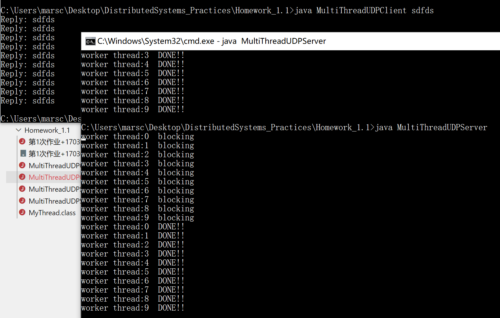

### 代码说明

先编译并运行 MultiThreadUDPServer.java

再编译并运行 MultiThreadUDPClient.java

后者会循环发送 10 个 udp 数据报，前者创建 10 个进程对应返回数据报——由于 Server 返回数据的线程自带一个 `sleep(1000)`，所以可见第一个线程结束的时间点在最后一个线程创建之后。

由此可见，所有请求的返回是并行运行的。

